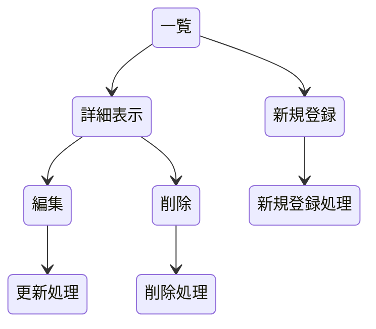

#### めも
利用者向けの仕様書は過保護に．スクショ貼って，赤線で囲んだり「ここをクリック！！」みたいに書こう

#### めちゃ大まかな構想
著作権フリーBGMなどを配布するサイトをまとめて，その概要と利用規約を確認できる機能を実装する．

#### データ構造の決定
サイト名と，そのURLを対応させて並べる形．
（概要欄の表記必須や，有料，無料を絵文字やマークで指定してもいいかも）
詳細表示で，利用規約やサイト特徴のやんわり私解釈で書く．
実際のサイトの利用規約のページに飛ぶ．

#### ページ構造の決定
ページ最初の一覧に名前とURL，下の方に新規登録のボタン．一覧の名前クリックでその対象の詳細表示に移行できる．
詳細表示では，名前，URLに加え，概要と大雑把な利用規約を私解釈で書く．詳細な実際の利用規約ページにも飛べる．その下部に削除と変更に飛べるリンクを設置する．物理的に距離を空ける．
編集画面では，テキストボックスみたいなものにid,name,URL,有料か無料か,商業利用の可否,クレジットの表記の有無,概要,利用規約概要,利用規約ページをそれぞれ入力，
詳細から削除画面に飛ぶと，「name」を本当に削除しますか？と表示する．

#### ページ遷移の決定
以下に示したフローチャート
それぞれの処理が終わったら一覧に戻る

##### フローチャート

#### HTTPメソッドとリソース名の決定
おおよその構造概念の説明みたいなもの，実際のコードの話ではない．

