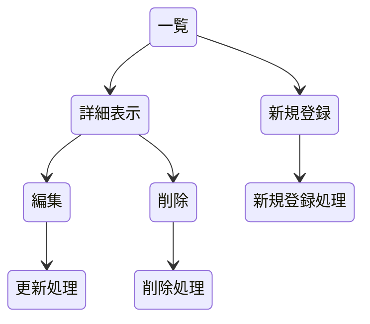

## 開発者用仕様書（仮）

### 概要
BGMを配布しているWebサイトを記録し，その利用規約などの情報を表示する．

### HTTPメソッドとリソース名一覧 
* ncm/ GET:一覧表示
* ncm/1 GET:1番の詳細情報を表示する．
* ncm/ POST:新規登録
* ncm/1 PUT:書き換える
* ncm/1 DELETE:削除する

### データ構造

### ページ推移

### リソース名ごとの機能の詳細