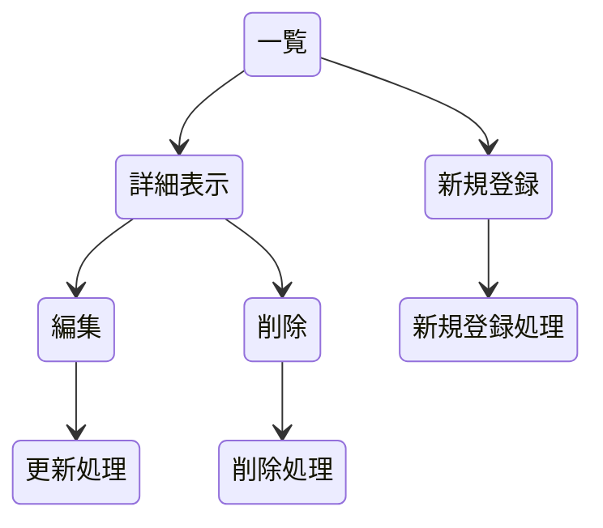

## 開発者用仕様書（仮）

### 概要
BGMを配布しているWebサイトを記録し，その利用規約などの情報を表示する．

### HTTPメソッドとリソース名一覧 
* ncm/ :一覧表示
* ncm/1 :1番の詳細情報を表示する．
* ncm/create :追加画面への移行
* ncm/edit/1  :１番の内容を編集画面へ
* ncm/delete/1 :１番の削除画面に

* ncm/ :すべてのデータ
* ncm/1 :１番のデータ
### データ構造

### ページ推移

### リソース名ごとの機能の詳細